# CRM

Vue.js + Express + MongoDB + Redis

## Установка и запуск

```bash
cp .env.example .env
cd api && npm i
cd ../app && npm i
docker compose up -d
docker compose exec api npm run seed
```

## Скриншоты

### Авторизация

<p float="left">
  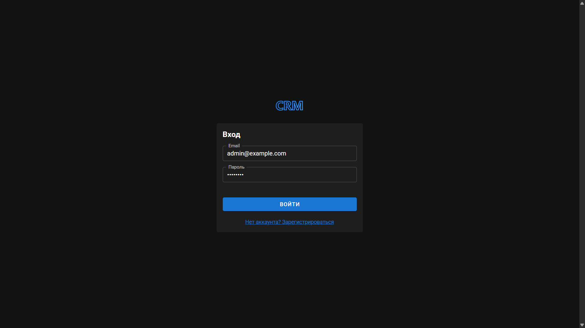
  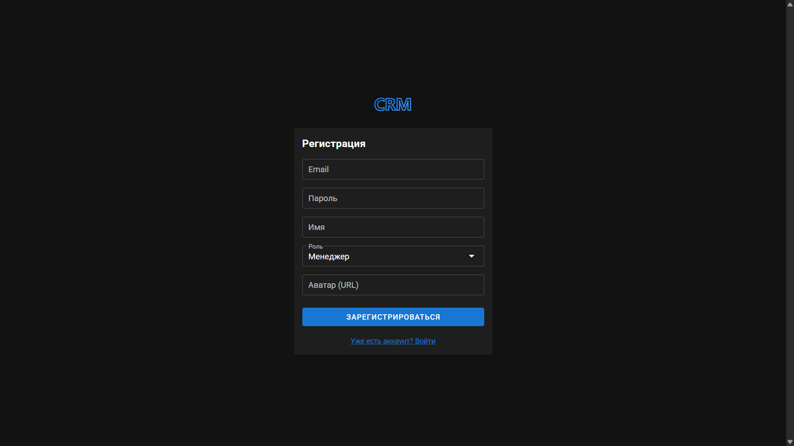
</p>

### Дашборд

<p float="left">
  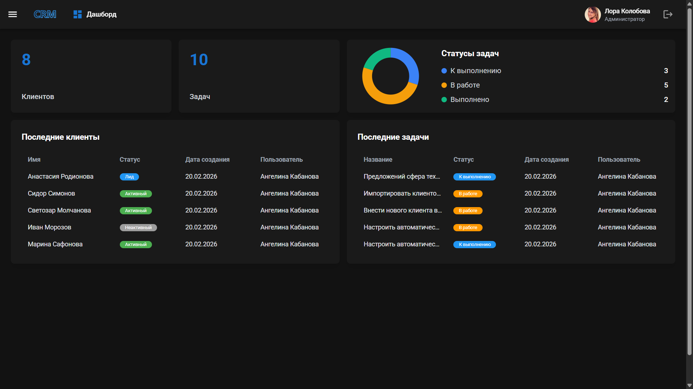
  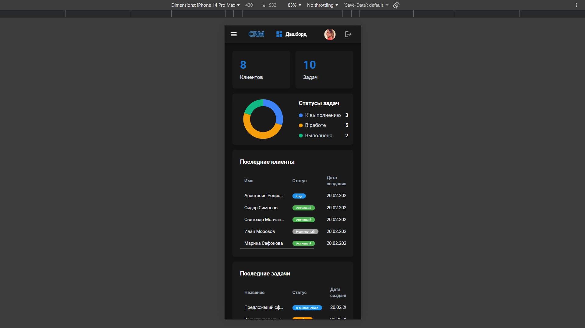
</p>

### Боковое меню

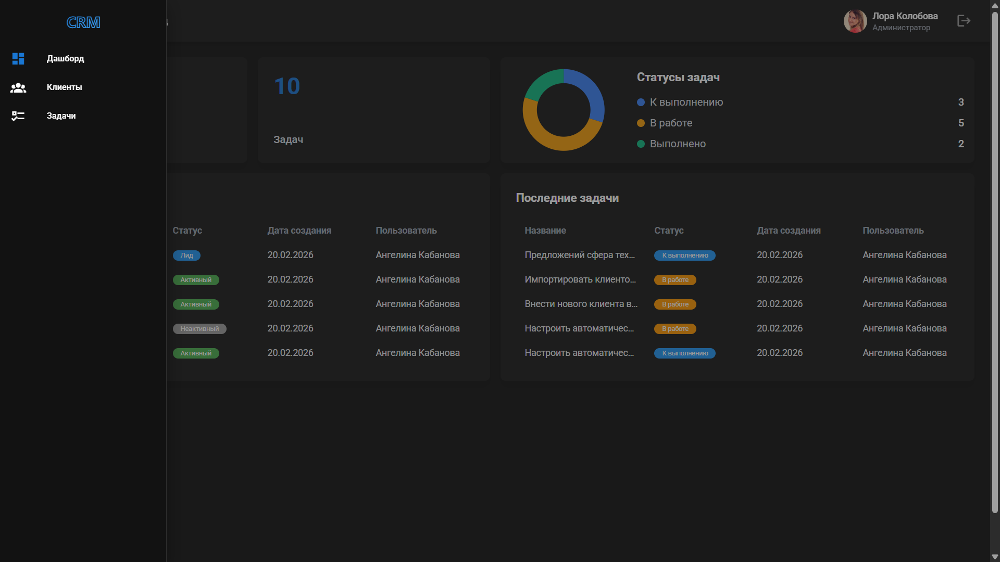

### Клиенты

<p float="left">
  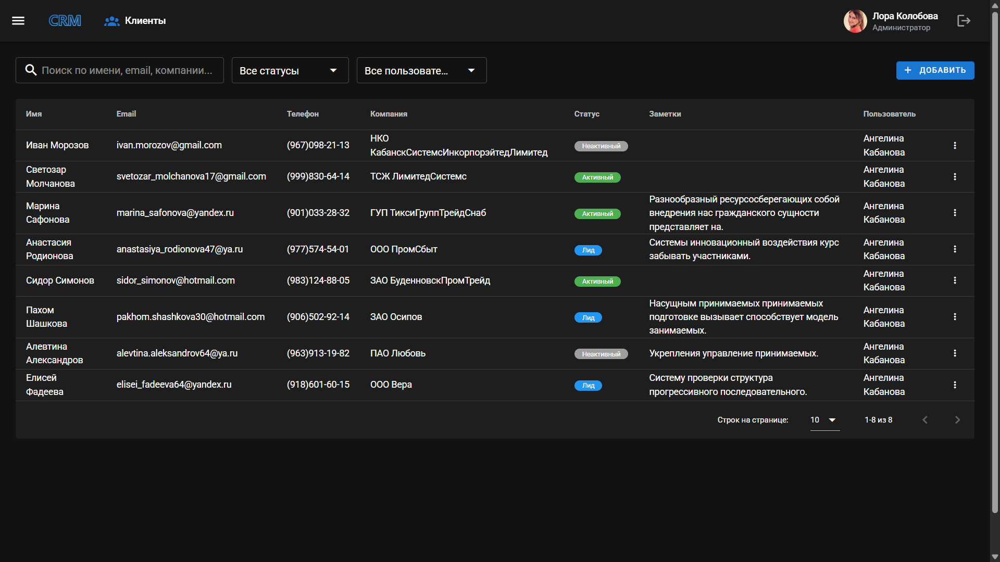
  
</p>

### Задачи

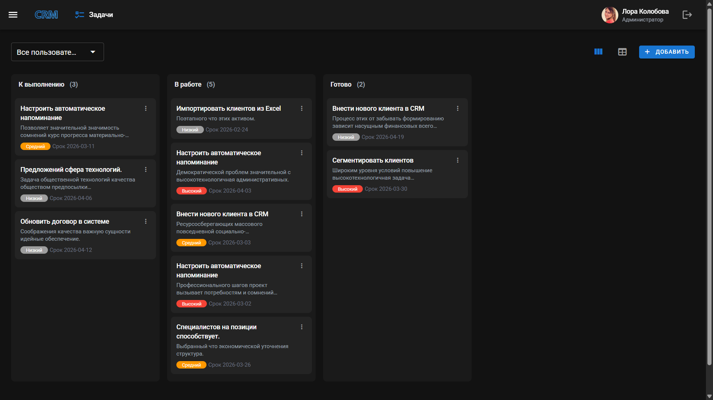

### Профиль

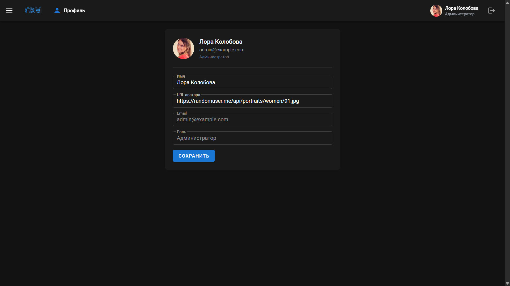

### Инфраструктура

<p float="left">
  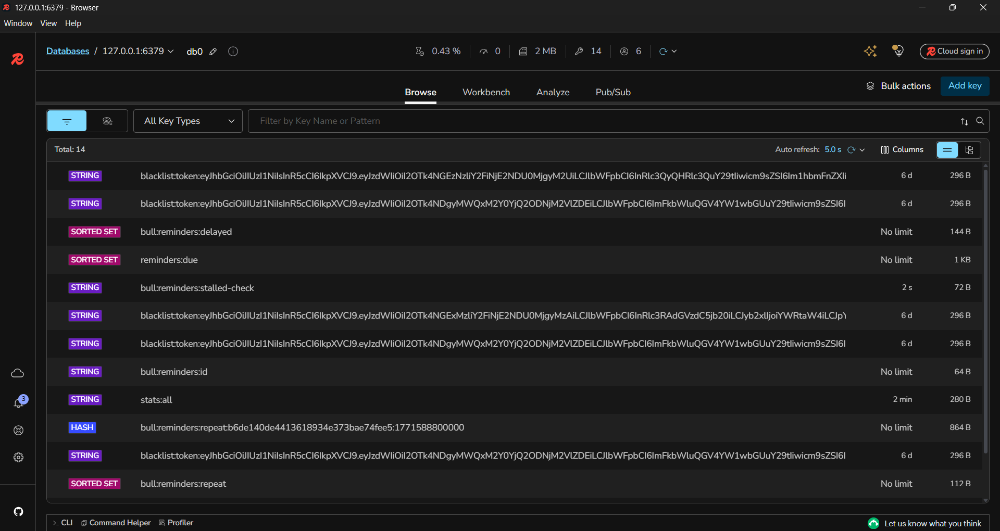
  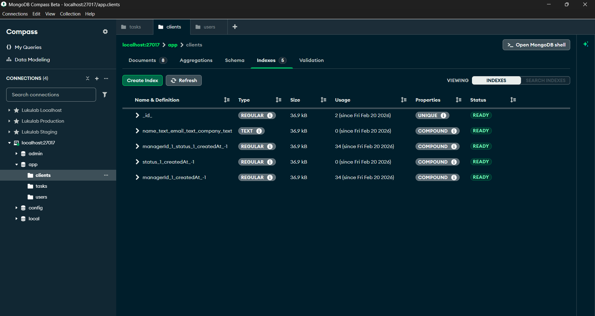
</p>

### Напоминания

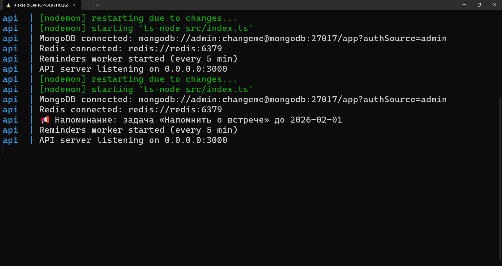
